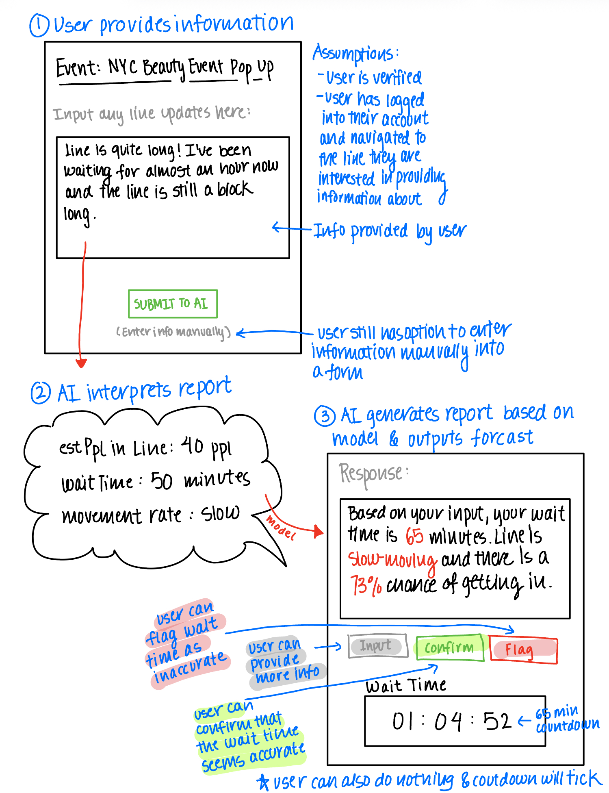

# LineLens
A real-time transparency app for urban event-goers.

## AI-Augmentation Component: Prediction Engine
This Prediction Engine component of my project aims to inform users about their wait time based on existing information and predictions from AI and statistical logic. 

## Code Structure
- ``aiPredictionEngine.spec`` (contains AI-Augmented Concept Specification, which can also be viewed [below](#predictionengine-ai-augmented-concept-specification))
- ``aiPredictionEngine.ts`` (core component)
  - **See [here](#high-level-code-overview) for helpful, more detailed, high-level overview of my AI-augmentation process in aiPredictionEngine.ts.** 
- ``aiPredictionEngine-tests.ts`` (test suite and demo runs)

See general file details at the end [here](#file-details). 

## PredictionEngine: Original Concept Specification (unchanged)
    concept PredictionEngine

    purpose Generate forecasts of wait times and entry likelihood using historical + live data.

    principle Combine statistical models with user reports and current queue status to generate predictions.

    state
      a set of Predictions with
        queueID
        historicalData (past attendance, average wait times)
        liveReports (inputs from UserReport)
        predictionResult (estWaitTime, entryProbability, confidenceInterval)
        lastRun

    actions
      runPrediction(queueID: String): predictionResult: Object, lastRun:DateTime
        requires queueID must exist
        effect generates updated prediction results for wait time and entry likelihood
              based on historical + live inputs

      getForecast(queueID: String): predictionResult: Object, lastRun:DateTime
        requires queueID must exist
        effect returns the most recently available prediction and lastRun

## AIPredictionEngine: AI-Augmented Concept Specification

    concept PredictionEngine

    purpose
        Generate forecasts of wait times and entry likelihood and outputs a thorough summary of 
        information based on AI predictions and user input.

    principle
        Combines user reports about queue status and LLM natural-language interpretation
        to produce structured predictions and user-facing summaries. The LLM will:
          - Interpreting free-text user reports into structured fields (estPplInLine, 
          estimatedWaitMins, movementRate, entryOutcome) which is used for running predictions
          - Generating concise human summaries of predictions

    state
        a set of Predictions with
            queueID
            historicalData
            liveReports
            predictionResult (estWaitTime, entryProbability, confidenceInterval, aiSummary)
            lastRun

    actions

        interpretReport(reportText: String, queueID: String): StructuredReport: Object
            requires queueID must exist
            effect sends natural-language report to LLM and returns {estPplInLine, 
            estimatedWaitMins, movementRate, entryOutcome, aiConfidence}.
            The system validates the result, stores it as a UserReport, and uses it in subsequent predictions

        runPrediction(queueID: String): predictionResult: Object, lastRun:DateTime
            requires queueID must exist
            effect generates updated prediction results using structured stats + 
            LLM refinement

        summarizeForecast(queueID: String, predictionResult: Object): aiSummary: String
            requires queueID, predictionResult must exist
            effect generates a human-readable forecast (e.g. “About a 1 hr wait, slow entry pace 
            with 65% chance of getting in”)

  Notes about validators & safety
  - LLM outputs are always parsed and validated. Numeric fields are coerced to integers and must be in reasonable bounds (0 <= wait <= 24*60, 0 <= entryProbability <= 100).
  - The LLM may not add arbitrary new state fields or invent extraneous events (such outputs are filtered).
  - The system retains the manual/pure-statistical pipeline so that functionality remains available without LLM involvement


## User Interaction (w/ sketches)




- *User Journey*: Sarah arrives at an event, finds the event in LineLines and types into the input box: “line is halfway down the block, moving fast” into the app's feedback form. The AI interprets this into ~40 people with an estimated 25 min wait. The forecast screen updates with: “About a half an hour wait, fast entry pace, 90% chance of getting in.” Sarah sees the summary and decides whether to stay. If she disagrees, she has the option to revise the numbers manually / provide more information / flag the response. If she agrees she can hit the confirm button or simple do nothing, and the timer in the app will provide a countdown to track the passing time that is consistent with output time. 


## Test Cases & Prompts (What wored, went wrong, remaining issues)

1. **Test Case: Clear, moderately detailed report**

This is for user-reports along the lines of “Line wraps around two blocks, maybe ~30 people ahead, moving steady but slow.” The LLM must interpret this into structured numbers that fit the designated parameters and apply a forecast. I tested the direct JSON-only prompt (Variant 0), which asks the LLM to extract and return only the structured fields. The model usually returned a clean JSON block with a reasonable people estimate and wait time, which parsed without issues. Occasionally, the LLM added commentary outside the JSON or spelled numbers as words (“thirty”), which broke parsing. Finally, remaining work includes adding examples or number-word normalization to ensure robust parsing.

2. **Test Case: Short, compact report**

This is for user-reports like “About 10 ppl ahead, inside building, moving fast. I am close.” The system must handle minimal context and infer a short wait. In this scenario, I used a role-based *conservative* prompt (Variant 1), which directs the LLM to return null when uncertain rather than guessing. The model was cautious, producing consistent small estimates and marking ambiguous fields as null, which was good and expected. However, it sometimes ignored contextual hints like “inside building,” giving overly generic estimates. Eventually, confidence scores should be surfaced in the UI so users can confirm or revise when the LLM hedges too much.

3. **Test Case: Ambiguous, noisy report**

A user could write a report like “Crazy long, not moving at all. People leaving, looks like a disaster, probably >100 people.” The LLM must handle hyperbole and ambiguous or no numbers. For this, I tried a guided mapping prompt (Variant 2), which included heuristics (e.g., one block ≈ 20 people) to reduce ambiguity. This model was better at mapping vague phrases to structured values and marking movementRate as stopped. Sometimes it turned items like “>100” into invalid strings or exaggerated values, and occasionally hallucinated extra context like “VIP lines.” Remaining work includes adding stricter validators to reject implausible outputs and cap large numbers, plus a fallback when reports are extreme or adversarial.

## Plausible Issues + Corresponding Validators

1. Non-numeric / malformed extraction  
2. Contradictory fields 
3. Hallucinated fields 

For my prototype, I pinpoint a few catagories of plausible issues that my LLM would face and added validators to attempt to catch them. The first category is **non-numeric or malformed extraction**, where the model might return text like “about fifty” or produce output that is not valid JSON. To handle this, the code extracts JSON fragments from the LLM response, attempts tolerant cleaning, and then enforces numeric values using Number(x), rejecting any negative or non-finite results. A second category is **contradictory fields**, such as cases where the LLM suggests estPplInLine=0 but estimatedWaitMins=120. The system already rejects out-of-range numbers, and future work includes adding a coherence check to flag contradictions, leave them for manual review, or even re-query the LLM with refined instructions. A third issue involves **hallucinated fields**, where the LLM may invent attributes not part of the schema (e.g., creating a “VIP lane”). To guard against this, the ``validateInterpreted`` function strictly accepts only allowed keys and throws an error if unexpected structured values appear. Finally, the ``runPrediction`` function also calls ``runPredictionValidators``, which ensures that any numeric overrides suggested by the LLM are within acceptable ranges before being applied.

## High-Level Code Overview
1. `createQueue(...)` — this function creates an in-memory queue record and an empty report list for queue

2. `submitUserReport(...)` — this appends a raw UserReport object (contains rawText & timestamp) to the queue’s report list and return a generated report id.

3. `interpretReport(...)` **[LLM USAGE HERE]** — this locates the report by id, builds an interpret prompt (one of 3 variants), calls the LLM to convert free text into a JSON, parses & validates the JSON, and write structured fields back into the stored UserReport. Then it will finally returns the updated UserReport.

4. `runPrediction(queueID)` — this function aggregates historical values and any interpreted reports to compute numeric predictions (est wait minutes, entry probability, confidence interval). Save a preliminary PredictionResult, then call the LLM (see step 4) to produce an AI summary. It also validates any suggested numeric overrides before applying them, save the final prediction, and return it.

5. `summarizeForecast(queueID)` **[LLM USAGE HERE]** - this function asks the LLM to produce a single-sentence JSON summary and numeric suggestions.
    - No variants used here, just one prompt for simplicity! 
    - Sample summary: 'The queue is experiencing significant variability. While the baseline estimate is 45 minutes with a 73% entry probability, recent reports range from a fast-moving line with about 10 people inside to a "disaster" with over 100 people and no movement. The wait time could be anywhere from 30 to 60 minutes.'

## File Details

```
project/
├── package.json                # Dependencies and scripts
├── tsconfig.json               # TypeScript configuration
├── config.json                 # Key goes here
├── aiPredictionEngine.ts       # DayPlanner class implementation
├── gemini-llm.ts               # LLM integration
├── aiPredictionEngine.spec     # Specification
├── aiPredictionEngine-tests.ts # Test cases and examples
├── dist/                       # Compiled JavaScript output
└── README.md                   # This file
```

### Run the Application

**Run all test cases:**
```bash
npm start
```

## Resources

- [Google Generative AI Documentation](https://ai.google.dev/docs)
- [TypeScript Documentation](https://www.typescriptlang.org/docs/)
